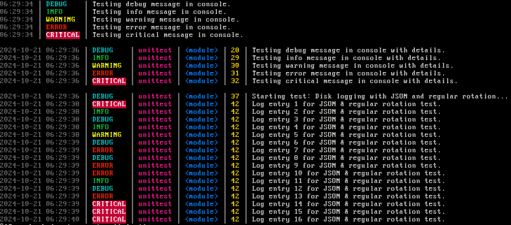

# Advanced Python Logging (APV)
> Flexible & powerful logging solution for Python applications



## Table of Contents
- [Introduction](#introduction)
- [Requirements](#requirements)
- [Features](#features)
- [Installation](#installation)
- [Configuration Options](#configuration-options)
- [Usage](#usage)
    - [Basic Console Logging](#basic-console-logging)
    - [Console Logging with Details](#console-logging-with-details)
    - [File Logging with Rotation](#file-logging-with-rotation)
    - [File Logging with Compression and JSON Format](#file-logging-with-compression-and-json-format)
    - [Graylog Integration](#graylog-integration)
    - [AWS CloudWatch Integration](#aws-cloudwatch-integration)
    - [Mixing it all together](#mixing-it-all-together)
- [Testing](#testing)

## Introduction
APV emerged from a simple observation: despite the abundance of logging solutions, there's a glaring lack of standardization in application logging. As a developer deeply entrenched in Elasticsearch, AWS, and Graylog ecosystems, I found myself repeatedly grappling with inconsistent log formats and cumbersome integrations. APV is my response to this challenge – a logging library that doesn't aim to revolutionize the field, but rather to streamline it.

This project is rooted in pragmatism. It offers a clean, efficient approach to generating logs that are both human-readable and machine-parseable. APV isn't about reinventing logging; it's about refining it. It provides a unified interface that plays well with various logging backends, from local files to cloud services, without sacrificing flexibility or performance.

While there's no shortage of logging libraries out there, APV represents a distillation of best practices I've encountered and challenges I've overcome. It's designed for developers who appreciate clean, consistent logs and seamless integration with modern logging infrastructures. If you're tired of wrestling with logging inconsistencies in production environments, APV might just be the solution you didn't know you were looking for.

## Requirements
- [Python 3.10+](https://www.python.org/)
    - [boto3](https://boto3.amazonaws.com/v1/documentation/api/latest/guide/quickstart.html) *(Optional: for CloudWatch logging)*
    - [ecs-logging](https://github.com/aws-observability/aws-ecs-logging) *(Optional: for ECS logging)*

## Features
- **Console Logging with Colors**: Enhanced readability with colored log messages in the console.
- **File Logging**: Write logs to files with support for log rotation based on size and number of backups.
- **Log Compression**: Automatically compress old log files using gzip to save disk space.
- **JSON Logging**: Output logs in JSON format for better structure and integration with log management systems.
- **ECS Logging**: Output logs in ECS format for better integration with [Elasticsearch](https://www.elastic.co/elasticsearch/)
- **Detailed Log Messages**: Option to include module name, function name, and line number in log messages.
- **Graylog Integration**: Send logs to a [Graylog](https://www.graylog.org/) server using GELF over UDP.
- **AWS CloudWatch Integration**: Send logs to [AWS CloudWatch Logs](https://docs.aws.amazon.com/AmazonCloudWatch/latest/logs/WhatIsCloudWatchLogs.html).
- **Customizable Logging Levels**: Set the logging level to control verbosity.

## Installation
To install APV, you can use the provided `setup.py` script:

1. **Clone the repository or download the source code.**

   ```bash
   git clone https://github.com/acidvegas/apv.git
   ```

2. **Navigate to the project directory.**

   ```bash
   cd apv
   ```

3. **Install the package using `setup.py`.**

   ```bash
   python setup.py install
   ```

   - **With CloudWatch support:**

     If you plan to use AWS CloudWatch logging, install with the `cloudwatch` extra:

     ```bash
     pip install .[cloudwatch]
     ```

   - **Alternatively, install `boto3` separately:**

     ```bash
     pip install boto3
     ```

   - **With ECS support:**

     If you plan to use ECS logging, install with the `ecs` extra:

     ```bash
     pip install .[ecs]
     ```

     - **Alternatively, install `ecs-logging` separately:**

       ```bash
       pip install ecs-logging
       ```

## Configuration Options

The `setup_logging` function accepts the following keyword arguments to customize logging behavior:

| Name                     | Default                  | Description                                                                          |
|--------------------------|--------------------------|--------------------------------------------------------------------------------------|
| `level`                  | `INFO`                   | The logging level. *(`DEBUG`, `INFO`, `WARNING`, `ERROR`, `CRITICAL`)*               |
| `date_format`            | `'%Y-%m-%d %H:%M:%S'`    | The date format for log messages.                                                    |
| `log_to_disk`            | `False`                  | Whether to log to disk.                                                              |
| `max_log_size`           | `10*1024*1024` *(10 MB)* | The maximum size of log files before rotation *(in bytes)*.                          |
| `max_backups`            | `7`                      | The maximum number of backup log files to keep.                                      |
| `log_file_name`          | `'app'`                  | The base name of the log file.                                                       |
| `json_log`               | `False`                  | Whether to log in JSON format.                                                       |
| `ecs_log`                | `False`                  | Whether to log in ECS format.                                                        |
| `show_details`           | `False`                  | Whether to include module name, function name, & line number in log messages.        |
| `compress_backups`       | `False`                  | Whether to compress old log files using gzip.                                        |
| `enable_graylog`         | `False`                  | Whether to enable logging to a Graylog server.                                       |
| `graylog_host`           | `None`                   | The Graylog server host. *(Required if `enable_graylog` is `True`)*                  |
| `graylog_port`           | `None`                   | The Graylog server port. *(Required if `enable_graylog` is `True`)*                  |
| `enable_cloudwatch`      | `False`                  | Whether to enable logging to AWS CloudWatch Logs.                                    |
| `cloudwatch_group_name`  | `None`                   | The name of the CloudWatch log group. *(Required if `enable_cloudwatch` is `True`)*  |
| `cloudwatch_stream_name` | `None`                   | The name of the CloudWatch log stream. *(Required if `enable_cloudwatch` is `True`)* |

## Usage

### Basic Console Logging

```python
import logging
import apv

# Set up basic console logging
apv.setup_logging(level='INFO')

logging.info('This is an info message.')
logging.error('This is an error message.')
```

### Console Logging with Details

```python
import logging
import apv

# Set up console logging with detailed information
apv.setup_logging(level='DEBUG', show_details=True)

logging.debug('Debug message with details.')
```

### File Logging with Rotation

```python
import logging
import apv

# Set up file logging with log rotation
apv.setup_logging(
    level='INFO',
    log_to_disk=True,
    max_log_size=10*1024*1024,  # 10 MB
    max_backups=5,
    log_file_name='application_log'
)

logging.info('This message will be logged to a file.')
```

### File Logging with Compression and JSON Format

```python
import logging
import apv

# Set up file logging with compression and JSON format
apv.setup_logging(
    level='DEBUG',
    log_to_disk=True,
    max_log_size=5*1024*1024,  # 5 MB
    max_backups=7,
    log_file_name='json_log',
    json_log=True,
    compress_backups=True
)

logging.debug('This is a debug message in JSON format.')
```

### Graylog Integration

```python
import logging
import apv

# Set up logging to Graylog server
apv.setup_logging(
    level='INFO',
    enable_graylog=True,
    graylog_host='graylog.example.com',
    graylog_port=12201
)

logging.info('This message will be sent to Graylog.')
```

### AWS CloudWatch Integration

```python
import logging
import apv

# Set up logging to AWS CloudWatch Logs
apv.setup_logging(
    level='INFO',
    enable_cloudwatch=True,
    cloudwatch_group_name='my_log_group',
    cloudwatch_stream_name='my_log_stream'
)

logging.info('This message will be sent to AWS CloudWatch.')
```

### ECS Logging

```python
import logging
import apv

# Set up logging to AWS CloudWatch Logs
apv.setup_logging(
    level='INFO',
    ecs_log=True
)
``` 

### Mixing it all together

```python
import logging
import apv

# Set up logging to all handlers
apv.setup_logging(
    level='DEBUG',
    log_to_disk=True,
    max_log_size=10*1024*1024,
    max_backups=7,
    log_file_name='app',
    json_log=True,
    compress_backups=True,
    enable_graylog=True,
    graylog_host='graylog.example.com',
    graylog_port=12201,
    enable_cloudwatch=True,
    cloudwatch_group_name='my_log_group',
    cloudwatch_stream_name='my_log_stream',
    show_details=True
)
```

## Testing

To run the test suite, use the following command:

```bash
python unittest.py
```

The test suite will run all the tests and provide output for each test.